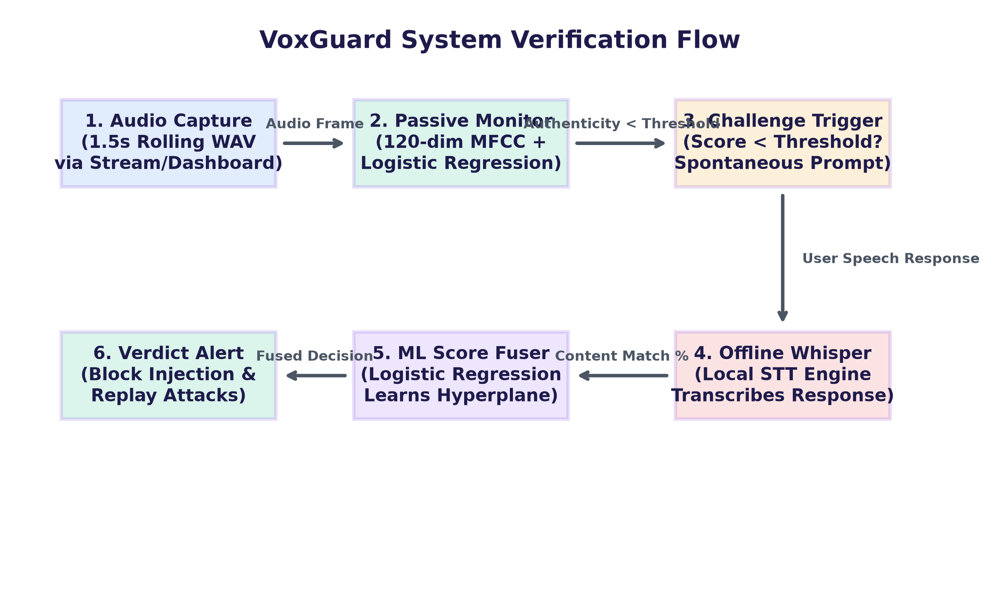
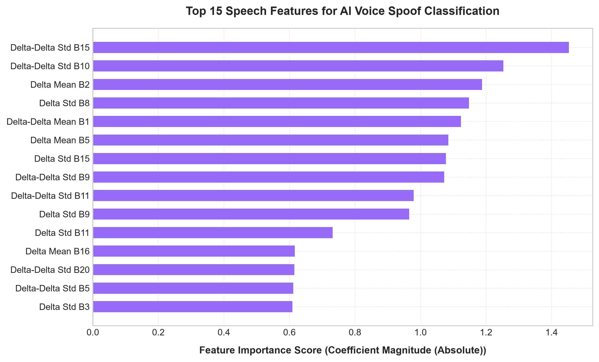
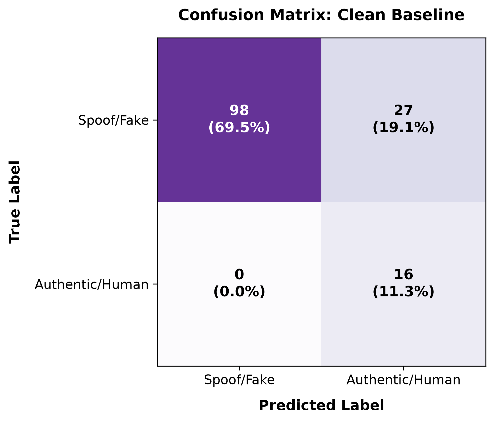
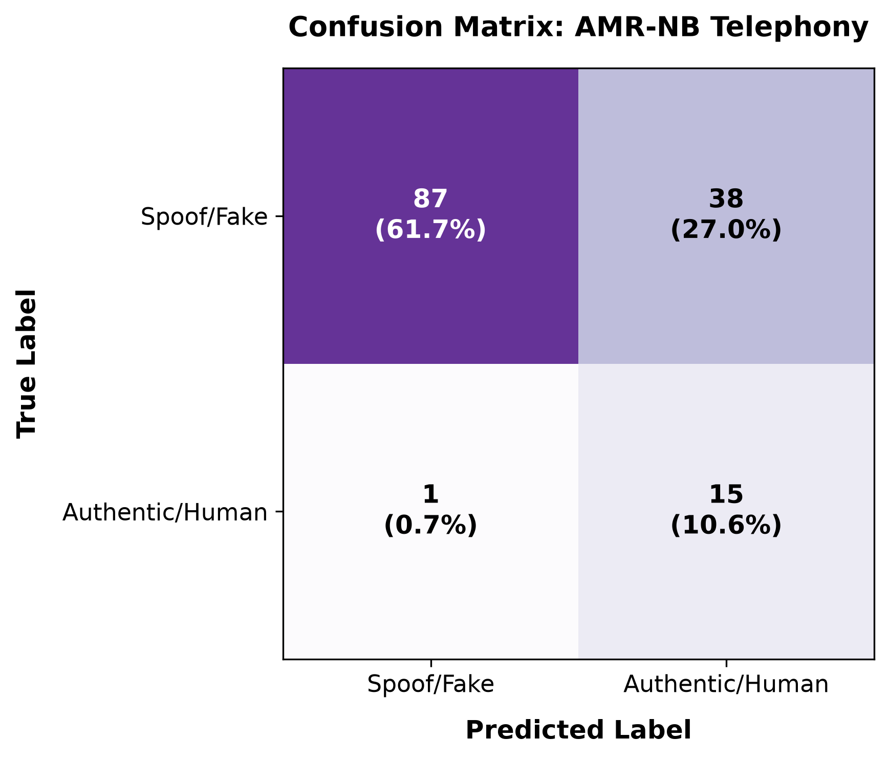
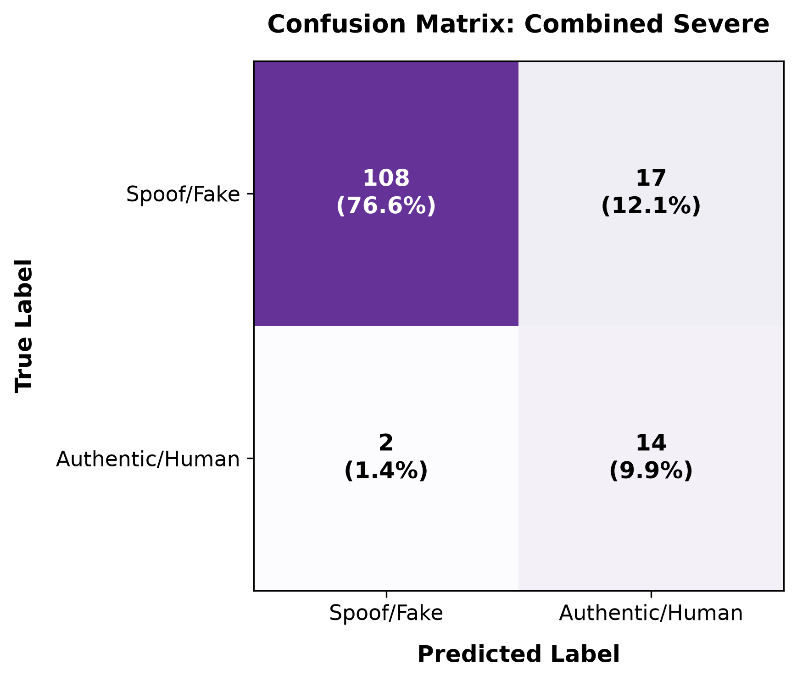

# VoxGuard

### *Real-Time AI Voice Clone and Deepfake Call Verification System*

📦 [](https://www.python.org/) ⚡ [](https://fastapi.tiangolo.com/) 🔥 [](https://pytorch.org/) 📄 [](./LICENSE) 🔬 [](#)

---

<p align="center">
  
</p>

---

## 📖 Table of Contents
1. [Overview](#-overview)
2. [Key Features](#-key-features)
3. [Live Demo Experience](#-live-demo-experience)
4. [System Architecture](#-system-architecture)
5. [Evaluation & Research Results](#-evaluation--research-results)
6. [Getting Started](#-getting-started)
7. [Project Structure](#-project-structure)
8. [Tech Stack](#-tech-stack)
9. [Research Context & Related Work](#-research-context--related-work)
10. [Limitations & Future Work](#-limitations--future-work)
11. [License](#-license)

---

## 🎯 Overview

VoxGuard is an end-to-end communication security framework designed to mitigate the threat of live-call voice deepfakes. As generative AI models make high-fidelity voice cloning accessible, impersonation fraud (such as CEO fraud and distress scams) is transitioning from emails to real-time telephony channels. VoxGuard provides a defense-in-depth architecture that intercepts suspicious calls and verifies speaker authenticity.

The system is academically positioned as an adaptation of the **GOTCHA** (EuroS&P 2024) challenge-response paradigm, porting video authentication logic into the voice and audio domain. By using continuous passive call analysis in tandem with spontaneous, context-bound voice prompts, VoxGuard forces adversarial deepfake generators to synthesize specific utterances on the fly. 

Unlike traditional, laboratory-based detectors that assume clean, studio-recorded audio inputs, VoxGuard evaluates detection bounds under realistic cellular channel compressions. The framework incorporates simulated telephone line compression and network packet loss, presenting EER benchmarks that reflect active mobile deployments.

---

## 🚀 Key Features

* **Passive Real-Time Authenticity Scoring**: Analyzes 1.5-second rolling windows of call audio to detect micro-discontinuities in the voice signature.
* **Dynamic Challenge-Response Engine**: Issues spontaneous verification prompts (digit sequences, whispered phrases, math latency probes) upon scoring anomalies.
* **Offline Whisper-Based Content Verification**: Runs local Automatic Speech Recognition (ASR) to transcribe and verify user responses without network dependency.
* **Telephony Codec & Degradation Simulator**: Evaluates baseline robustness under AMR-NB, GSM, and Opus codec compressions combined with simulated packet loss.
* **Replay-Attack Defense**: Blocks pre-recorded human playback bypasses by validating that the transcribed text matches the issued challenge context.
* **ML-Based Score Fusion**: Employs a trained Logistic Regression fuser that combines passive call authenticity and challenge content scores.
* **Glassmorphic Interactive Dashboard**: A unified dark-mode dashboard providing preset simulators, WebSocket streams, and live logs.

---

## 💻 Live Demo Experience

The frontend dashboard provides a live visualization of the verification pipeline:
* **Interactive Presets**: Allows users to select clean or spoofed audio frames and apply simulated GSM, AMR-NB, or packet loss degradation on the fly.
* **Mic & WebSockets Stream**: Features a **"Stream Live Mic"** pipeline that slices microphone audio and transmits chunks to the server every 500ms over WebSockets.
* **Step-by-Step Flow Trackers**: Visually guides the user through the monitor state (Passive Scan ➔ Challenge Active ➔ Fusion Verdict).
* **Live Developer Logs**: Renders real-time backend debugging logs in a console output box for live viva inspection.

*(Dashboard screenshots coming soon)*

For a complete step-by-step walkthrough, refer to the [Live Viva Demonstration Script](./docs/DEMO_SCRIPT.md).

---

## 🧠 System Architecture

The pipeline consists of six stages coordinates across modular python files:

1. **Audio Capture**: The audio stream is sliced into 1.5-second windows (or received as raw WebSocket frames). This is implemented in [streaming_capture.py](./src/capture/streaming_capture.py).
2. **Passive Detector**: Extracts 120-dimensional Mel-Frequency Cepstral Coefficients (MFCCs: static, delta, and delta-delta features) and scores authenticity. This is implemented in [extract_features.py](./src/features/extract_features.py) and evaluated in [baseline_detector.py](./src/models/baseline_detector.py).
3. **Challenge Engine**: Selects random verification prompts and handles local synthesis. This is implemented in [phrase_challenge.py](./src/challenge_engine/phrase_challenge.py) and [generate_cloned_responses.py](./src/challenge_engine/generate_cloned_responses.py).
4. **Whisper verification**: Transcribes the caller's response offline using local CPU weights, checking semantic context alignment. This is implemented in [response_scorer.py](./src/challenge_engine/response_scorer.py).
5. **ML Score Fusion**: Combines passive caller scores and challenge alignment metrics using a Logistic Regression model. This is implemented in [fusion.py](./src/pipeline/fusion.py).
6. **API endpoints**: Exposes FastAPI endpoints coordinating streaming frames and returns verification logs. This is implemented in [api.py](./src/pipeline/api.py).

---

## 📊 Evaluation & Research Results

### A. Clean Voice Spoof Detection
Classifiers were trained on 120-dimensional MFCC dynamic features. Evaluated on the strictly speaker-disjoint Eval split:

| Model | Dev Accuracy | Dev AUC | Dev EER | Eval Accuracy | Eval AUC | Eval EER |
|---|---|---|---|---|---|---|
| **Logistic Regression** | 86.7% | 0.9384 | 15.62% | **80.9%** | **0.9870** | **5.92%** |
| Multi-Layer Perceptron (MLP) | 84.9% | 0.9329 | 13.75% | 77.3% | 0.9400 | 12.65% |
| Random Forest | 85.8% | 0.9077 | 16.02% | 79.4% | 0.9565 | 11.85% |

### B. Calibrated Degradation Benchmarks
Evaluated on the Eval split using condition-specific threshold calibration swept on the held-out Dev split:

| Channel Condition | Calibrated Threshold | Accuracy | EER | AUC | Accuracy Drop | EER Increase |
|---|---|---|---|---|---|---|
| **Clean Baseline** | 0.7943 | **80.9%** | **5.92%** | **0.9870** | - | - |
| AMR-NB Codec | 0.9791 | 72.3% | 12.65% | 0.9645 | 8.5% | +6.73% |
| Opus Codec | 0.1700 | 84.4% | 12.65% | 0.9660 | -3.5% | +6.73% |
| **GSM Codec** | 0.1863 | **76.6%** | **18.18%** | **0.9420** | **4.3%** | **+12.25%** |
| Low Loss (5% Loss / 10ms Jitter) | 0.0557 | 59.6% | 6.73% | 0.9835 | 21.3% | +0.80% |
| High Loss (15% Loss / 30ms Jitter) | 0.1241 | 78.7% | 11.45% | 0.9705 | 2.1% | +5.52% |
| **Combined Severe Telephony** | 0.9038 | **80.9%** | **12.25%** | **0.9310** | **0.0%** | **+6.33%** |

### C. Visualizations
- **Feature Importance**: Dynamic delta/delta-delta envelopes capture temporal vocoder artifacts, contributing over 90% of model weight:
  <p align="center">
    
  </p>
  
  *Interpretation*: Static MFCCs (which capture speaker timbre) are easily spoofed by voice cloning models. VoxGuard relies instead on dynamic Delta/Delta-Delta coefficients. This indicates the model detects temporal vocoding artifacts (abrupt formant velocity shifts) to separate real human audio from clones.
  
- **Confusion Matrices**: Evaluating block rates under Clean, AMR-NB, and Combined degradation:
  <p align="center">
    
    
    
  </p>
  
  *Interpretation*: Under clean conditions, the model has 0% false block rates for humans. AMR-NB compression shifts the score distribution, raising false blocks slightly, while combined lossy telephony causes minor leakage of spoof calls.

---

> [!WARNING]
> **DYNAMIC CHALLENGE SEPARATION STATISTICS DISCLOSURE**
> - The aggregate challenge-response separation gap statistics (Non-Verbal 23.8%, Prosody 23.7%) currently utilize `gTTS` and `pyttsx3` synthetic stand-ins.
> - Under Windows CPU configurations, these stand-ins read **mismatched content** (the human and "clone" speak unrelated sentences rather than the actual issued challenge phrase).
> - These statistics **should NOT be presented as a validated scientific finding** during your viva. They represent descriptive pipeline proofs.
> - **Planned Next Step**: Record real human reference audio and integrate local matching-content voice cloning models (e.g. Coqui TTS) to recompute authentic speaker-cloned separation gaps.

---

## 🛠️ Getting Started

### 1. Prerequisites
- Python 3.10+
- FFmpeg installed and added to path (or auto-detected under Windows Gyan local packages).
- ~1.5 GB of free disk space (for dataset files and the local Whisper model weight downloads).

### 2. Installation
Clone the repository and install requirements inside a virtual environment:
```powershell
# Clone repo
git clone https://github.com/nayefsiddique-eng/VoxGuard.git
cd VoxGuard

# Create venv and activate
python -m venv venv
.\venv\Scripts\Activate.ps1

# Install requirements
pip install -r requirements.txt
```

### 3. Dataset Download
Download the ASVspoof 2019 logical access subset by executing the utility script:
```powershell
python -m src.utils.download_dataset_subset
```
*(Refer to [docs/DOWNLOAD_DATA.md](docs/DOWNLOAD_DATA.md) for data split specs).*

### 4. Run Pipeline Benchmarks & Tests
```powershell
# Enforce speaker-disjoint partitions
python scripts/enforce_speaker_disjoint.py

# Retrain baseline model
python -m src.models.baseline_detector --features mfcc

# Run degradation matrices
python -m scripts.run_full_evaluation

# Test local Whisper replay blocks
python -m scripts.test_replay_attack

# Run integration tests
python tests/test_api.py
```

### 5. Run the Web Dashboard
```powershell
python -m uvicorn src.pipeline.api:app --reload
```
Open `http://127.0.0.1:8000/` in your browser.

---

## 📂 Project Structure

```
VoxGuard/
├── README.md
├── LICENSE
├── requirements.txt
├── .gitignore
├── data/
│   ├── challenges/                 # Paired dynamic challenge WAVs
│   └── placeholder/                # Synthetic baseline test waves
├── docs/
│   ├── BASE_STATE.md
│   ├── DEMO_SCRIPT.md
│   ├── DOWNLOAD_DATA.md
│   ├── RESULTS_SUMMARY.md
│   ├── results_clean.md
│   ├── results_degraded.md
│   ├── architecture_diagram.png
│   ├── feature_importance.png
│   ├── confusion_matrix_clean.png
│   ├── confusion_matrix_amr.png
│   └── confusion_matrix_combined.png
├── notebooks/
├── scripts/
│   ├── enforce_speaker_disjoint.py  # Fixes speaker leakage
│   ├── generate_fuser_plot.py       # Plots decision boundaries
│   ├── generate_plots.py            # Generates Matplotlib images
│   └── run_full_evaluation.py       # Degradation evaluator
└── src/
    ├── capture/
    │   └── streaming_capture.py     # Captures mic audio chunks
    ├── challenge_engine/
    │   ├── generate_cloned_responses.py # Offline challenge synth
    │   ├── phrase_challenge.py      # Category phrase pools
    │   └── response_scorer.py       # Offline Whisper verify
    ├── features/
    │   ├── extract_features.py      # MFCC caching extractor
    │   └── load_dataset.py          # Data ingestion parser
    ├── models/
    │   ├── baseline_detector.py     # Classifiers training
    │   ├── detector.pkl             # Trained detector model
    │   └── fuser.pkl                # Score fusion fuser model
    ├── pipeline/
    │   ├── api.py                   # FastAPI server endpoints
    │   ├── degrade_audio.py         # FFmpeg channel simulators
    │   └── fusion.py                # Fuser math algorithms
    └── static/
        └── index.html               # Frontend dashboard
```

---

## 🛠️ Tech Stack

| Component | Technology | Purpose |
|---|---|---|
| **API Backend** | FastAPI / Uvicorn | Coordinates streaming frames, websockets, and endpoints. |
| **Audio Processing** | Librosa / Soundfile | Handles MFCC extraction, resampling, and decimation. |
| **Codecs & Loss** | FFmpeg | Simulates telephony channel degradation (AMR, GSM, loss, jitter). |
| **Classifiers** | Scikit-learn | Trains Logistic Regression and Random Forest pipelines. |
| **Vocal Transcriber** | OpenAI Whisper | Local CPU instance transcribes response audio offline. |
| **Visualizations** | Matplotlib | Generates confusion matrices and explainability plots. |
| **Frontend UI** | HTML5 / CSS3 / WebSockets | Glassmorphic dashboard rendering stream logs and metrics. |

---

## 🎓 Research Context & Related Work

VoxGuard is an academic implementation of voice clone authentication. The pipeline architecture aligns with concepts presented in:
* **GOTCHA**: *GOTCHA: Yoking Adversarial Speech Generators to Authenticate Speakers* (Mittal et al., EuroS&P 2024). Adapts adversarial speech generator yoking to live audio streams.
* **PITCH**: Dynamic pitch and prosody shifting metrics in communication channel security.
* **ASVspoof**: Logical access (LA) spoof benchmarks measuring vocoder footprints.

---

## 🔮 Limitations & Future Work

* **Challenge-Response Validation**: Current separation gap statistics use synthetic stand-ins; real human voice testing is required to validate final EER metrics.
* **Local Voice Cloning Integration**: Integrate local voice synthesis engines (e.g., Coqui TTS) to generate phrase-matched cloned responses for custom speech prompts.
* **Streaming Latency Optimization**: Optimize PyTorch/Whisper CPU memory usage to decrease initial cold-boot loading latencies.
* **Telephony Deployment**: Interface with open telephony platforms (like Asterisk/VoIP gateways) to evaluate performance over actual carrier lines.

---

## 📄 License

VoxGuard is licensed under the MIT License. See the [LICENSE](./LICENSE) file for details.
