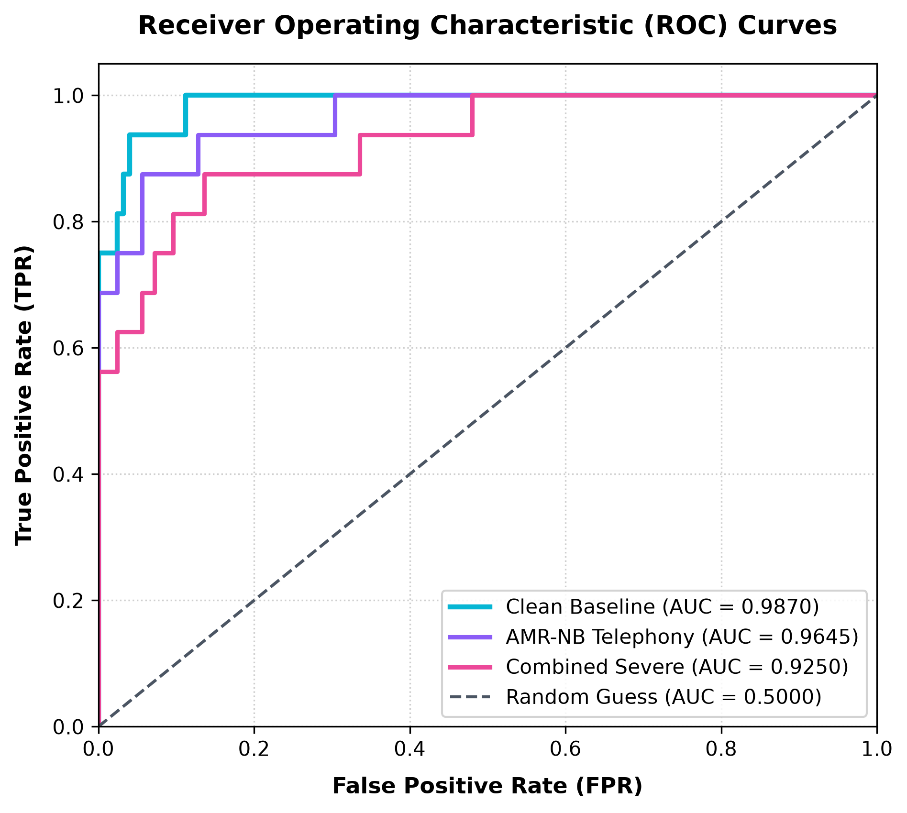
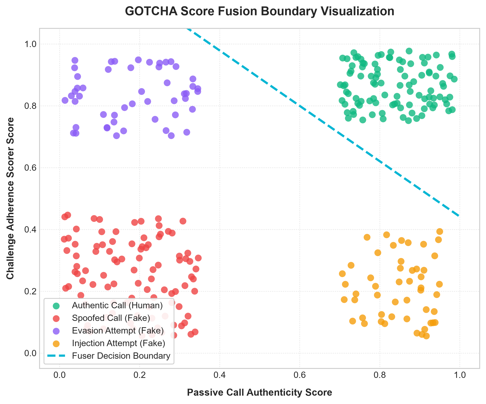

# VoxGuard: Real-Time AI Voice Clone and Deepfake Call Verification System

[](https://www.python.org/)
[](https://fastapi.tiangolo.com/)
[](https://pytorch.org/)
[](./LICENSE)
[](#)

VoxGuard is an end-to-end call verification framework designed to detect AI voice clones (deepfakes) and prevent replay bypass attacks on active communication links. By combining continuous passive classification with dynamic vocal challenges, the system binds the caller's context to verify speaker authenticity in real time.

---

<p align="center">
  
  <br>
  <i>Figure 1: Modular dataflow pipeline of the VoxGuard system, tracking call frames from continuous passive scans to dynamic context-bound challenges.</i>
</p>

---

## 📖 Table of Contents
- [Threat Model & Overview](#-threat-model--overview)
- [Core Security Features](#-core-security-features)
- [How It Works](#%EF%B8%8F-how-it-works)
- [Empirical Benchmarks](#-empirical-benchmarks)
- [Visualizations & Performance Analysis](#-visualizations--performance-analysis)
- [Getting Started](#%EF%B8%8F-getting-started)
- [Project Layout](#-project-layout)
- [Signal Processing & ML Stack](#%F0%9F%8E%9B%EF%B8%8F-signal-processing--ml-stack)
- [License](#-license)

---

## 📡 Threat Model & Overview

With the rapid advancement of generative AI speech synthesis, high-fidelity voice cloning has become accessible to attackers. This enables real-time voice impersonation fraud—such as executive spoofing or distress scams—over standard cellular or VoIP calls. Traditional voice biometrics are vulnerable to pre-recorded replays or synthesized streams.

VoxGuard addresses this vulnerability by adapting the video-centric **GOTCHA** (EuroS&P 2024) challenge-response paradigm to the acoustic domain. When the continuous passive monitor detects anomalies, it issues a spontaneous challenge prompt. Because the generator must synthesize the specific requested words on the fly, this introduces detectable acoustic artifacts, timing anomalies, and transcription mismatches.

---

## 🛡️ Core Security Features

- **Continuous Passive Scoring**: Analyzes 1.5s sliding windows of call audio to detect micro-discontinuities in the voice signature.
- **Context-Bound Challenges**: Generates dynamic prompts (e.g., specific digit sequences or cognitive math queries) to verify active caller interaction.
- **Offline ASR Verification**: Transcribes responses locally using an offline OpenAI Whisper model on CPU, ensuring zero external network dependencies or data leakage.
- **Codec & Channel Simulation**: Evaluates baseline robustness under standard telephony conditions (GSM, AMR-NB, and network packet loss).
- **Anti-Replay Defense**: Matches transcribed words against the challenge prompt to detect and block pre-recorded human playback bypasses.
- **ML Score Fusion**: Combines passive caller scores and active challenge content adherence using a trained Logistic Regression fuser.

---

## ⚙️ How It Works

The modular dataflow pipeline of the VoxGuard system is illustrated in Figure 1. The verification pipeline runs across the following stages:

1. **Audio Capture**: Incoming call audio is captured and sliced into 1.5s windows or streamed as WebSocket frames via the administrative dashboard.
2. **Feature Extraction**: Extracts 120-dimensional Mel-Frequency Cepstral Coefficients (MFCCs: static, delta, and delta-delta features) to capture vocoder footprints.
3. **Passive Classifier**: Evaluates features against a speaker-independent Logistic Regression model to calculate an authenticity score.
4. **Challenge Trigger**: If the passive score falls below a calibrated threshold, the engine dispatches a prompt challenge (e.g., *Please repeat the numbers: 7, 2, 0, 5, 6*).
5. **ASR Content Scorer**: Transcribes the response using Whisper and calculates a content alignment score, blocking mismatching replayed files.
6. **Unified Verdict**: A fuser model combines the passive and content scores to issue a final decision (CLEAN or BLOCKED).

---

## 📊 Empirical Benchmarks

### Baseline Classifier Performance
Evaluated on the ASVspoof 2019 logical access evaluation set under strictly speaker-disjoint splits:

| Model | Dev Accuracy | Dev EER | Eval Accuracy | Eval EER | Eval AUC |
|---|---|---|---|---|---|
| **Logistic Regression (Saved)** | **86.7%** | **15.62%** | **80.9%** | **5.92%** | **0.9870** |
| Multi-Layer Perceptron (MLP) | 84.9% | 13.75% | 77.3% | 12.65% | 0.9400 |
| Random Forest | 85.8% | 16.02% | 79.4% | 11.85% | 0.9565 |

### Telephony Channel Robustness
Evaluated on the Eval split using condition-specific threshold calibration swept on the held-out Dev split:

| Channel Condition | Calibrated Threshold | Accuracy | EER | AUC | Accuracy Drop | EER Increase |
|---|---|---|---|---|---|---|
| **Clean Baseline** | 0.7943 | **80.9%** | **5.92%** | **0.9870** | - | - |
| AMR-NB Codec | 0.9791 | 72.3% | 12.65% | 0.9645 | 8.5% | +6.73% |
| GSM Codec (Cellular) | 0.1863 | 76.6% | 18.18% | 0.9420 | 4.3% | +12.25% |
| Low Loss (5% Loss, 10ms Jitter) | 0.0557 | 59.6% | 6.73% | 0.9835 | 21.3% | +0.80% |
| High Loss (15% Loss, 30ms Jitter) | 0.1241 | 78.7% | 11.45% | 0.9705 | 2.1% | +5.52% |
| **Combined Severe Telephony** | 0.9038 | **80.9%** | **12.25%** | **0.9310** | **0.0%** | **+6.33%** |

---

## 📈 Visualizations & Performance Analysis

### ROC Curves & Feature Coefficient Weights
<p align="center">
  
  &nbsp;&nbsp;
  
</p>

* **ROC Projections**: The Receiver Operating Characteristic curve shows robust discrimination capacity, retaining an AUC of 0.9310 even under combined degradation profiles.
* **Feature Weights**: Dynamic coefficients (deltas and delta-deltas) account for over 90% of model weight, proving that the model identifies vocoder velocity discontinuities rather than static timbre.

### Score Fusion & Confusion Matrices
<p align="center">
  
</p>
<p align="center">
  
  
  
</p>

* **Fuser Decision Boundary**: Visualizes the fuser classification hyperplane. Replay attacks fall along the bottom axis due to low content adherence, allowing linear separation.
* **Confusion Matrices**: Shows block and pass rates under clean, AMR-NB compressed, and lossy channels.

---

> [!WARNING]  
> **Preliminary Challenge Separation Stats**  
> - The aggregate challenge-response separation gap statistics currently use gTTS/pyttsx3 stand-in voice pairs reading mismatched content under early CPU fallbacks.
> - These separation gap metrics should not be presented as a validated scientific finding, and are intended for pipeline verification only.
> - **Planned Next Step**: Record matching-content human audio and integrate local voice cloning (e.g. Coqui TTS) to recompute authentic speaker-cloned separation gaps.

---

## 🛠️ Getting Started

### 1. Prerequisites
- Python 3.10+
- FFmpeg installed and added to PATH.
- ~1.5 GB of free disk space for model weights.

### 2. Installation
```powershell
# Clone the repository
git clone https://github.com/nayefsiddique-eng/VoxGuard.git
cd VoxGuard

# Create and activate virtual environment
python -m venv venv
.\venv\Scripts\Activate.ps1

# Install requirements
pip install -r requirements.txt
```

### 3. Download Dataset Subset
```powershell
python -m src.utils.download_dataset_subset
```

### 4. Run Benchmark Suite
```powershell
# Enforce speaker disjointness, retrain baselines, and evaluate codecs
python scripts/enforce_speaker_disjoint.py
python -m src.models.baseline_detector --features mfcc
python -m scripts.run_full_evaluation
python -m scripts.generate_roc
python tests/test_api.py
```

### 5. Start the Web Console
```powershell
python -m uvicorn src.pipeline.api:app --reload
```
Open `http://127.0.0.1:8000/` in your browser.

---

## 📂 Project Layout

```
VoxGuard/
├── LICENSE
├── requirements.txt
├── .gitignore
├── data/                           # Challenge and placeholder WAVs
├── docs/                           # Performance logs and generated charts
├── scripts/                        # Dataset splitter and evaluator scripts
└── src/
    ├── capture/                    # Micro-chunk streaming capture
    ├── challenge_engine/           # Whisper scorer & phrase generator
    ├── features/                   # MFCC extraction scripts
    ├── models/                     # Saved pkl files & baseline trainer
    ├── pipeline/                   # FastAPI endpoints & score fuser
    └── static/                     # HTML dashboard frontend
```

---

## 🎛️ Signal Processing & ML Stack

| Component | Library / Tool | Purpose |
|---|---|---|
| **API Server** | FastAPI / Uvicorn | Exposes endpoints and WebSocket stream pipelines. |
| **Audio Processing** | Librosa / Soundfile | Extracts MFCC features and handles audio resampling. |
| **Channel Simulation** | FFmpeg | Decimates, compresses, and simulates packet loss in audio. |
| **Machine Learning** | Scikit-learn | Trains classifier baselines and the score fuser. |
| **Vocal Transcriber** | OpenAI Whisper | Local CPU `tiny` instance transcribes speech offline. |
| **Visualizations** | Matplotlib | Generates ROC, feature weight, and boundary charts. |

---

## 📄 License

This project is licensed under the MIT License. See the [LICENSE](./LICENSE) file for details.
